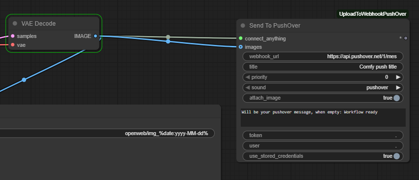
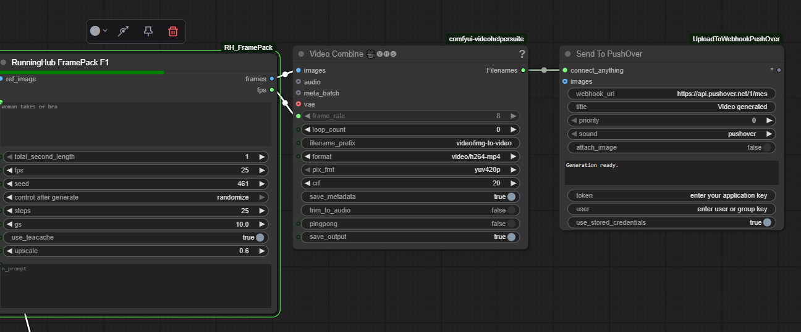

# ComfyUI_UploadToWebHookPushover <br>
Thanks to Jerryswap UploadToWebhook customnode which I could use as base code for the pushover node.
[](https://github.com/jerrywap/ComfyUI_UploadToWebhookHTTP/stargazers)




A custom node for [ComfyUI](https://github.com/comfyanonymous/ComfyUI) that allows you to _send generated image(s)_  directly to Pushover, you can also choose only to get a notifycation. Videos aren't supported.

---

## ✨ Features

- 🔗 Upload a single image (from image sequence) with your pushover notification (optional)
- 📦 Includes additional message text (prompt for example)

---

## 🔧 Installation (for updating from v1.0.x to v1.2.x read the update.md file.)

1. Clone or download this repo into your `ComfyUI/custom_nodes` directory:

```
cd /workspace/ComfyUI/custom_nodes
git clone https://github.com/MijnSpam/ComfyUI_UploadToWebhookPushOver.git
```

2. Install dependencies:

```
cd ComfyUI_UploadToWebhookPushOver
bash install.sh
This part can fail with pip env but just check if it runs without doing the packages install.
```

3. Restart ComfyUI (or use the **Reload Custom Nodes** button if available).
4. Refesh browser.

---

## 🧩 How to Use

In Pushover.net create an application token and paste this into your Token field.
Optional, edit default value in __init__.py 
Optional: Create a delivery group if you want to be flexible in notifying devices. _(then you only need to edit in pushover instead of changing userkeys)_
In User field, enter specific device key **or** add group key.

In ComfyUI:

1. Drag any output (e.g., from `VAE Decode`) to the **Send To Pushover** node >> connect_anything

2. Configure:
    - `connect_anything` : connect any output (mandatory to work)
    - `webhook_url`: default is correct.
    - `token`: the pushover app token (or use stored credentials option, see step 3)
    - `user`: Your user OR group key.
    - `image`: if you want an image in your pushover, connect this node and switch on attach_image
3. Optional (since version 1.2)
   create an .env in the same folder as this custom-node, see example folder but rename to '.env'
   in the node select, 'use stored credentials', any credentials in the node fields will be ignored **even when you enter them!**
---

## 🖼️ UI Example




---

## 📁 Folder Structure

```
ComfyUI_UploadToWebHookPushOver/
├── __init__.py
├── requirements.txt
└── install.sh
└── pyproject.toml
└── .env (optional file see how to use step 3)
```

---

## 🧑‍💻 Contributing

Pull requests and feature ideas are welcome!  
Feel free to fork and create a PR.

---

## 📄 License

This project is licensed under the MIT License.  
See [LICENSE](./LICENSE) for details.
