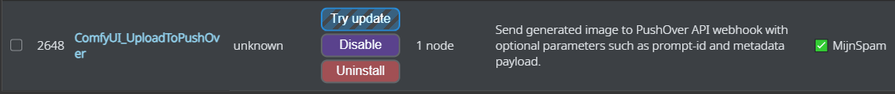
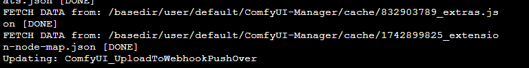

## 🔧 Úpdate v1.0.x to v1.2.0

1. In the custom nodes manager
   find your installed ComfyUI_UploadToPushOver node.
   Hit try update:
   
2. It can happen that your Manager doesn't report to restart, if so hit the restart button from the manager menu.
   
   __It could also be that a restart is already happening in the backgroud__. 
3. Refresh your browser.

4. Due redesign of the node it's best to re-add it into your workflow as connect_anything is now mandatory and the images input isn't.